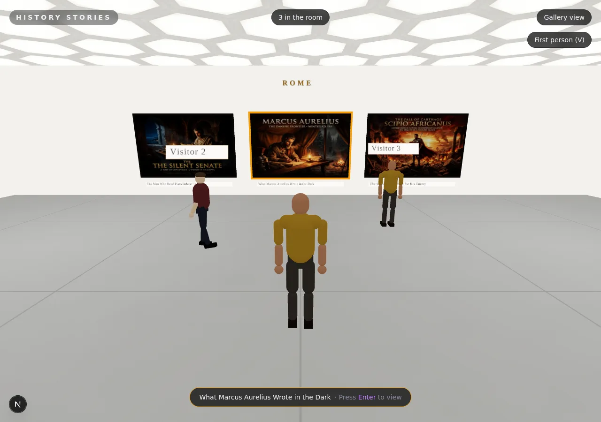

# History Stories

**A multiplayer 3D museum you can walk through in your browser, where every painting is a short story from history.**

[**historystories.vercel.app**](https://historystories.vercel.app) — open it with a friend and walk the gallery together.

  



## Why History Stories?

I've been learning Roman and Indian history, and I wanted a place to collect short stories about how historic figures faced their challenges: Marcus Aurelius, Karna, Hanuman, Scipio.

The site started as a static grid of cards. That worked, but history deserves better than a feed. So it became a museum: one bright gallery room inspired by [The Broad](https://www.thebroad.org/) in LA, with each story hung as a framed painting on its tradition's wall. Then it grew a body, and then it grew company: you walk the room in third person, and other live visitors materialize beside you.

Everything past the original card grid was built autonomously by Claude (Fable 5), running unattended for 6-8 hours at a stretch on a single goal. See [How it was built](#how-it-was-built).

## Quick Start

```bash
git clone https://github.com/Monte9/history-stories.git
cd history-stories
pnpm install
pnpm dev
```

Open [localhost:3000](http://localhost:3000) and walk in. Open a second tab at `localhost:3000/?net=local` in the same browser to meet yourself. `pnpm build` produces a fully static export.

## Features

- **A walkable gallery.** First-person or third-person room with white walls, a polished concrete floor, and a glowing honeycomb skylight ceiling. Three tradition walls (Rome, Ramayana, Mahabharata) plus a curator's wall with the newest acquisitions.
- **A body.** A procedural articulated avatar with a real gait: stride locked to your displacement (it cannot foot-skate), walk and sprint cycles, turn-in-place shuffle, idle breathing. Four characters with distinct skin, outfits, hair, and build; new browsers get one at random.
- **Live multiplayer, zero backend.** Visitors connect peer-to-peer over WebRTC with public Nostr relays for signaling — no server, no accounts, no API keys. Friends materialize with staged fades, walk with interpolated motion, wear "Visitor N" labels, and vanish cleanly. A counter chip shows how many are in the room.
- **Gaze focus.** Look at a painting anywhere in the room and it highlights with its tradition color. Press Enter to open the story.
- **Story pages.** Each story is real history with dates, names, and context, topped by a three-panel treatment of its cinematic cover art. Escape drops you back in the room exactly where you stood, with your friends still around you.
- **Works everywhere.** Keyboard, trackpad, and mouse on desktop; touch controls and tap-to-open on mobile; a flat [gallery view](https://historystories.vercel.app/gallery) as the no-WebGL and accessibility fallback.
- **Zero-wiring publishing.** Drop a markdown file in `stories/` with a cover in `public/covers/` and the next build hangs it on the right wall automatically.

## Controls

| Input | Action |
|---|---|
| Arrow keys / WASD | Walk and turn |
| Shift (hold) | Sprint |
| Trackpad scroll | Walk (vertical) and turn (horizontal) |
| Click + drag | Look around |
| Enter | Open the focused painting |
| Esc | Step back into the room |
| V | Toggle first / third person |
| B | Change your character |
| Touch | On-screen movement cluster, tap a painting to focus, tap again to open |

## Architecture

- **Next.js static export.** No backend. Markdown files with frontmatter are the database; git is the CMS; Vercel auto-deploys on push.
- **The room** is one client-only [react-three-fiber](https://github.com/pmndrs/react-three-fiber) scene (`src/components/museum/`). Lighting, layout math, the avatar gait, the chase camera, and gaze focus are plain three.js.
- **Presence** (`src/components/museum/presence/`) sits behind one transport interface: [trystero](https://github.com/dmotz/trystero) (WebRTC over public Nostr relays) in production, a BroadcastChannel reference transport (`?net=local`) for same-browser testing, and `?net=off` to opt out. Pose-only ~80-byte messages at 10 Hz, heartbeat timeout, interpolation with a teleport rule, an 8-avatar render cap with honest accounting. Lazy-loaded after the room renders; the solo museum never pays for it.
- **Texture pipeline.** A `sharp` prebuild step thumbnails every cover into `public/covers/thumbs/` so the room loads webp thumbs instead of full-size PNGs.
- **Stories** live in `stories/*.md` (frontmatter: title, tradition, character, date, cover). Covers are AI-generated cinematic art in `public/covers/`.

## How it was built

This repo is also an experiment in autonomous building. Everything past the original card grid — the museum, the third-person body, the multiplayer presence — was specced, built, and shipped by Claude (Fable 5) in unattended 6-8 hour runs:

- `agent/GOAL.md` holds the human-written goal. A planner agent expands it into `agent/SPEC.md` and an ordered sprint backlog (`agent/BACKLOG.md`) with draft acceptance criteria.
- **Criteria are agreed before code.** At each sprint's start, a fresh-context evaluator reviews the draft acceptance criteria and strengthens them toward the best outcome for the goal, not just "it works". The agreed list is committed before the builder writes a line.
- The builder implements the sprint, then a separate fresh-context evaluator grades the running site with Playwright against the agreed criteria and `agent/RUBRIC.md` — driving real browsers, sampling pixels, simulating crowds of peers. Verdicts are committed to `agent/evals/`. An implementation that meets the letter of every criterion but misses the goal fails.
- Failed sprints get fixed and re-evaluated before landing on main. Periodic "curator taste audits" rank shippability findings, which become the next sprint's criteria. The loop ran 17 sprints across the museum, body, and multiplayer arcs — including root-causing a production multiplayer bug inside a dependency's relay lifecycle and proving the fix with a two-browser, seven-minute idle test.

Story generation has its own pipeline: project skills in `.claude/skills/` write the story, generate the cover, and publish, with `history.json` tracking coverage to avoid repetition.

## Development

```
stories/          published story markdown
public/covers/    cover art (thumbs generated at build)
src/              Next.js app, the museum scene, presence
agent/            build harness: goal, spec, backlog, rubric, eval verdicts
.claude/skills/   story generation and publishing pipeline
docs/             screenshots
```

`pnpm dev` runs the site locally, `pnpm build` must stay green (static export). The evaluator drives headless Chromium with SwiftShader, so the full museum — including multiplayer via the local transport — is testable in CI-like environments.

## Credits

- [Monte Thakkar](https://github.com/Monte9): direction, history curation
- Claude (Fable 5) by [Anthropic](https://www.anthropic.com): the museum, the body, the multiplayer, the stories, the cover art, this README

## License

[MIT](LICENSE)
