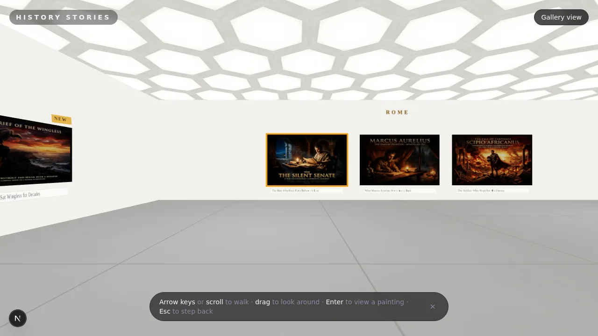

# History Stories

**A 3D museum you can walk through in your browser, where every painting is a short story from history.**

[**historystories.vercel.app**](https://historystories.vercel.app)

  



## Why History Stories?

I've been learning Roman and Indian history, and I wanted a place to collect short stories about how historic figures faced their challenges: Marcus Aurelius, Karna, Hanuman, Scipio.

The site started as a static grid of cards. That worked, but history deserves better than a feed. So it became a museum: one bright gallery room inspired by [The Broad](https://www.thebroad.org/) in LA, with each story hung as a framed painting on its tradition's wall. Walk up to one, and read it.

The whole museum was built autonomously by Claude (Fable 5) overnight, working in planner/builder/evaluator sprints while I slept. See [How it was built](#how-it-was-built).

## Quick Start

```bash
git clone https://github.com/Monte9/history-stories.git
cd history-stories
pnpm install
pnpm dev
```

Open [localhost:3000](http://localhost:3000) and walk in. `pnpm build` produces a fully static export.

## Features

- **A walkable gallery.** First-person room with white walls, a polished concrete floor, and a glowing honeycomb skylight ceiling. Three tradition walls (Rome, Ramayana, Mahabharata) plus a curator's wall with the newest acquisitions.
- **Gaze focus.** Look at a painting anywhere in the room and it highlights with its tradition color. Press Enter to open the story.
- **Story pages.** Each story is real history with dates, names, and context, topped by a three-panel treatment of its cinematic cover art. Escape drops you back in the room exactly where you stood.
- **Works everywhere.** Keyboard, trackpad, and mouse on desktop; touch controls and tap-to-open on mobile; a flat [gallery view](https://historystories.vercel.app/gallery) as the no-WebGL and accessibility fallback.
- **Zero-wiring publishing.** Drop a markdown file in `stories/` with a cover in `public/covers/` and the next build hangs it on the right wall automatically.

## Controls

| Input | Action |
|---|---|
| Arrow keys / WASD | Walk and turn |
| Trackpad scroll | Walk (vertical) and turn (horizontal) |
| Click + drag | Look around |
| Enter | Open the focused painting |
| Esc | Step back into the room |
| Touch | On-screen movement cluster, tap a painting to focus, tap again to open |

## Architecture

- **Next.js static export.** No backend. Markdown files with frontmatter are the database; git is the CMS; Vercel auto-deploys on push.
- **The room** is one client-only [react-three-fiber](https://github.com/pmndrs/react-three-fiber) scene (`src/components/museum/`). Lighting, layout math, gaze focus, and camera persistence are plain three.js, about 1,300 lines total.
- **Texture pipeline.** A `sharp` prebuild step thumbnails every cover into `public/covers/thumbs/` so the room loads webp thumbs instead of full-size PNGs.
- **Stories** live in `stories/*.md` (frontmatter: title, tradition, character, date, cover). Covers are AI-generated cinematic art in `public/covers/`.

## How it was built

This repo is also an experiment in autonomous building. The museum was specced, built, and shipped by Claude (Fable 5) in unattended sprints:

- `agent/GOAL.md` holds the human-written goal. A planner agent expands it into `agent/SPEC.md` and an ordered sprint backlog (`agent/BACKLOG.md`).
- A builder works one sprint at a time, then a separate fresh-context evaluator grades the running site with Playwright against `agent/RUBRIC.md` and the sprint's acceptance criteria. Verdicts are committed to `agent/evals/`.
- Failed sprints get fixed and re-evaluated before landing. A final "curator taste audit" ranked shippability findings, which became the last sprint.

Story generation has its own pipeline: project skills in `.claude/skills/` write the story, generate the cover, and publish, with `history.json` tracking coverage to avoid repetition.

## Development

```
stories/          published story markdown
public/covers/    cover art (thumbs generated at build)
src/              Next.js app and the museum scene
agent/            build harness: goal, spec, backlog, rubric, eval verdicts
.claude/skills/   story generation and publishing pipeline
```

`pnpm dev` runs the site locally, `pnpm build` must stay green (static export). The evaluator drives a headless Chromium with SwiftShader, so the full museum is testable in CI-like environments.

## Credits

- [Monte Thakkar](https://github.com/Monte9): direction, history curation
- Claude (Fable 5) by [Anthropic](https://www.anthropic.com): the museum, the stories, the cover art, this README

## License

[MIT](LICENSE)
